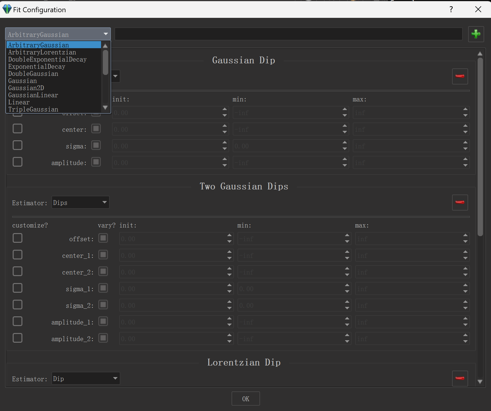
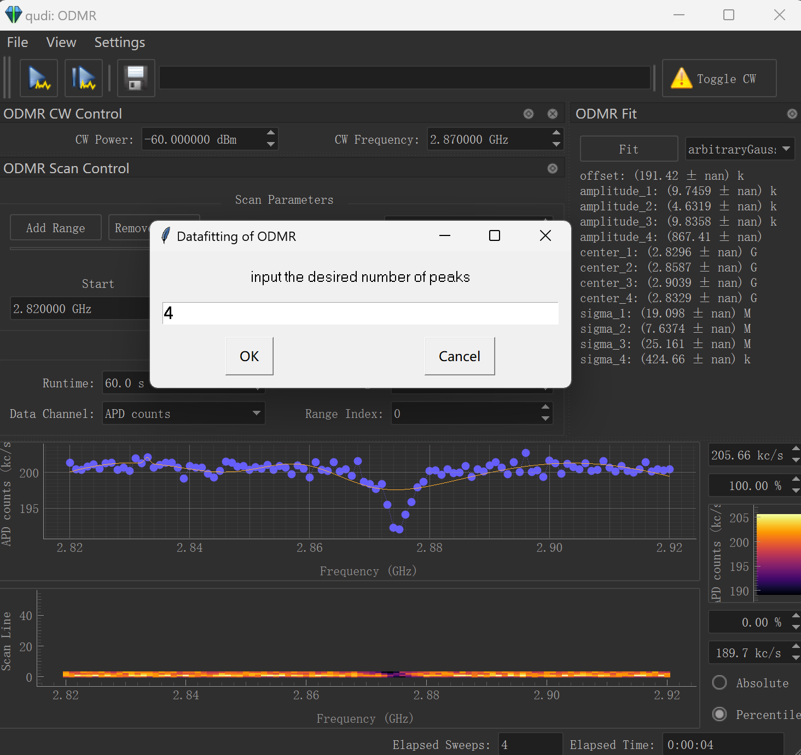

# Enhanced Datafitting in Qudi-Core

<b> 
    Ensemble-qudi-modules   <i>from</i></b> Physic Institute 3 of University Stuttgart <a href="https://www.pi3.uni-stuttgart.de/">🌟</a>

Author: <b>Chenyan</b>

---

## 1. Relevant Files
1. Two files locate under path: `src\qudi\util\fit_models\helpers.py` and `src\qudi\util\fit_models\Npeak.py`
2. copy them under path of qudi-core `qudi-core\util\fit_models` and replace original `helpers.py`
3. One extra package is used in Npeak to provide a additional external GUI for parameters input: `import easygui`. 

---

## 2. Funktion
1. `Npeak.py` provides two extra classes: ***ArbitraryGaussian*** and ***ArbitraryLorentzian***, making it possible to achieve a Gaussian/Lorentzian Datafitting with arbitrary number of peaks, which using a externel GUI (`easygui` package supported) to locate the external input in the class named **estimate_peaks**.

    

 

    

 

2.  `helpers.py` add a new class named **estimate_multiple_peaks**, is used to estimate the peaks(offset, center, amplitude, sigma) of data. 
3.  **estimate_multiple_peaks** : When the number of estimated peaks is obviously more than the actual situation(can avoid this happening by observing the diagramm with our eyes), it will show: *'cannot rightly caculate all the desired peaks!!'*.
4.  Basically, this two classes support all datafitting with a input of Integer. The premise is that he follows the previous rule.
5.  There are two options in menu: **dips or peaks**. Through swithing the option it can fit diffrent types of data. Set path:
`Settings -> Fit Configuration -> Estimator`

