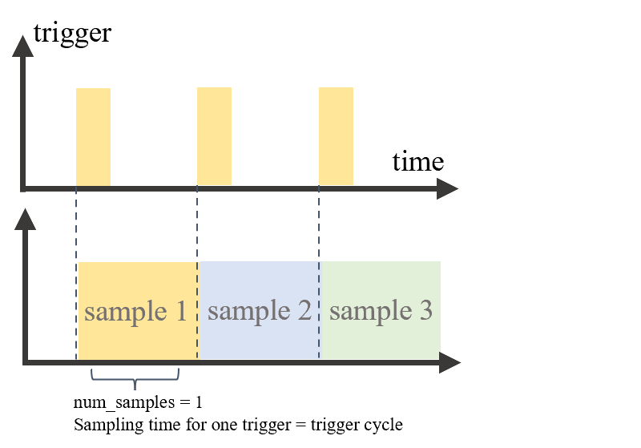
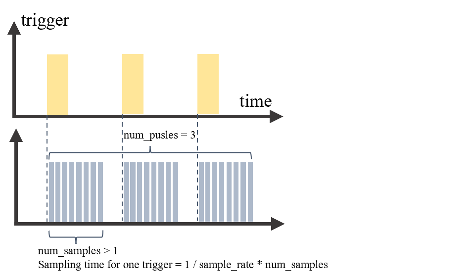
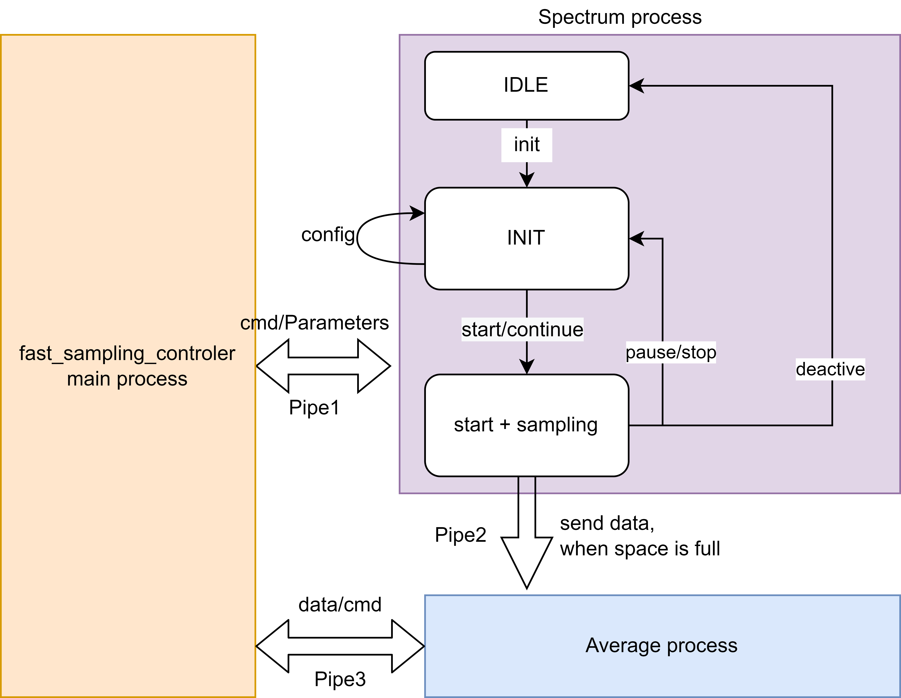

# Pulsed Logic Module driven by Spectrum/Nidaq

<p style="color:grey; font-size:1.2em;"><b> 
    Ensemble-qudi-modules <br> <i>from</i></b> Physic Institute 3 of University Stuttgart <a href="https://www.pi3.uni-stuttgart.de/">🌟</a>
</p>
<p align='right'>Author: <b>Chenyan</b><p>

---

## Introduction

The standard work flow of Pulsed Logic Module provided by Qudi is driven by Timetagger from company Swabian Instrument, which is powered by FPGA supporting parallel computing for both data acquisition and data processing (averaging). 

However, a standard data acquisition card is normally without a built-in pulse or averaging module. When the sampling frequency is too high and the amount of sampled data is large, if the averaging process is performed serially after data acquisition, the delay caused by the averaging process will greatly affect the high-speed data reception process, and the FIFO buffer of the data acquisition card will be filled up quickly. 

The following figure demonstrates why pulse logic often generates more data than normal data acquisition modes:

<p align = "center">    

</p> 

Unfortunately, some Nidaq and Spectrum data acquisition cards do not integrate averaging or pulse modules. Therefore, we propose a parallel architecture to solve this problem. All changes are integrated at the hardware level and do not interact with the upper logic level.

---

## Relevant Files

1. Modified files locate under path: 
   * For Nidaq: `ni_x_series/ni_x_fast_sampling.py` , `ni_x_series/ni_x_control.py`
   * For Spectrum: `spectrum/sepctrum_fast_sampling.py` + `spectrum/sepctrum_control.py`
2. Functionality division:
   * `..._fast_sampling.py`: the main functional component connects to the interface for Pulsed Logic Module.
   * `..._control.py`: responsible for implementing the functionality and state machine of each process in a multi-process environment.
3. Installation via third-party interfaces provided by Spectrum and Nidaq:
   * Nidaq: see details in <a href="https://nidaqmx-python.readthedocs.io/en/stable/#installation">NI-DAQmx Python Documentation</a>.
    ```bash
    $ python -m pip install nidaqmx
    ```
    * Spectrum: see details of `Low-level Python API` in <a href="https://spectrum-instrumentation.com/products/drivers_examples/python_library.php ">Python API of Spectrum</a>. Or directly copy all files in `src/qudi/hardware/thirdparty/spectrum` in your current qudi environment `env/Lib/`.

---

## Example of Configuration

```bash
hardware:
    spectrum_fast_sampling:
        module.Class: 'spectrum.spectrum_fast_sampling.SpectrumFastSampling'
        options:
            buffer_size: 8192       # unit: uint64(MEGA_B(4)), as huge as possible
            segment_size: 8192         # samples per trigger
            samples_per_loop: 1024  # unit: uint64(KILO_B( ))
            sample_rate: 20            # unit: int64(MEGA( ))
            channel: 0                 # channel = 1
            timeout: 5000              # unit: ms
            input_range: 5000          # unit: mV
            enable_debug: False

    ni_x_fast_sampling:
        module.Class: 'ni_x_series.ni_x_fast_sampling_v2.NIXSeriesFastSampling'
        options:
            # parameters of clock
            device_name : 'Dev1'
            clk_terminal : 'ctr0'
            sample_rate : 10           # this should be the same as the externel trigger rate
            frame_size : 100           # equavalent to number of triggers per loop
            frame_num : 2            # number of loops 
            physical_sample_clock_output: 'PFI12'
            # parameters of analog channels
            analog_channels : 'ai0'
            adc_voltage_range : (-5, 5)
            timeout : 20
            external_sample_clock_source : 'PFI0'
            _enable_debug : True
```

---

## Construction of `fast_sampling` Module
<p align = "center">    

</p> 

The complete signal table is：
   | signal             | Description                                                              |
   | -----------        | -----------                                                              |
   | controler_pipe1    | one side of pipe1, send cmd and paramaters to process of spectrum        |
   | spectrum_pipe1     | another side of pipe1, receive cmd and paramaters from main process, send some ready signal                                                                                    |
   | state_1            | state bit of pipe1, 1 for RUN, 0 for STOP                                |
   | average_pipe2      | one side of pipe2, use to receive data and cmd                           |
   | spectrum_pipe2     | one side of pipe2, use to send data and cmd                              |
   | controler_pipe3    | one side of pipe 3, use to send cmd and receive data                     |
   | average_pipe3      | one side of pipe 3, use to receive cmd and send averaged data            |
   | state_3            | state bit of pipe3, 1 for RUN, 2 for get data,  0 for STOP, -1 for exit  |

This mode works with 3 parallel processes:
- **MAIN process**: send control signal, let the FSM(Finite-state machine) in daq process reach the corresponding working state.
- **DAQ process**: contains a FSM, When in the SS state, data will be continuously collected until the predefined sampling limit is reached, and then the sampled data will be transferred to the next process.
- **AVERAGE process**: When receiving data from last process, store it in the buffer and average the data. This process will not stop until it gets a *get_data* command from main process.

Each of them use a unique cpu core to caculate, between them there're 3 pipes with 2 global variable to connect different processes and send message. With **Multiprocessing** package it's possible to do tasks described above, which makes it faster to work.

Both spectrum and Ni cards work in this construction.

---

## Some configuration details of Spectrum

Some important parameters of spectrum:
- *qwBufferSize* should be multiple of *lNotifySize*;
- in multiple-fifo mode, *lSegmentSize* determined, how many segments we will get, because the number of segments = 

$$
qwToTransfer / \ (lSegmentSize \cdot 2)
$$

beacuse here we use int16 type, 1 data corresponds 2 bytes;
- *lSegmentSize* should be multiple of *lNotifySize*;
- *lSegmentSize* --> number of data in one segment;
- *lNotifySize*  --> bytes of data in one notifycation.
- *samplerate* --> how many samples per second.

---

## Some configuration details of Nidaq

### Some important properties of Nidaqmx
1. The End of a Duty cycle is definited by the reader（*`CONTINUOUS`* mode）or the frame size of ai/di channel(*`FINITE`* mode). So always make sure that the buffer size of trigger is bigger than that of sampling's size！Otherweise it causes Fehler. 
2. It's possible to cofigerate multiple ai_channels, multiple di_channels but only one `clk/counter` channel, although in nidaq there're 2 `counter/clk` channels.
3. All `ai_channels` can be readed together, however the `di_channels` can only be readed separately.
4. In `ni_x_serjes_finite_multiple_sampling_input.py`, channels are stored in set, rather than list.
5. If parameter `number_of_samples` is omitted, this method will return the currently available samples within the frame buffer (i.e. the value of property `samples_in_buffer`). If `number_of_samples` is exceeding the currently available samples in the frame buffer, this method will block until the requested number of samples is available. If the explicitly requested number of samples is exceeding the number of samples pending for acquisition in the rest of this frame, raise an exception. This rule keep always working in not only Nidaqmx's package but also QUDI's logic.
6. For Nidamx, counter block is used to generate clock, so sometime we donnot distinguish the concept of them.

### *`FINITE`* mode and *`CONTINUOUS`* mode
*`FINITE`* mode and *`CONTINUOUS`* mode two very basical modes of Nidaqmx. I will introduce these two modes in the following parts.

> *`FINITE`* mode:

- *`FINITE`* mode means, the task will end only when the buffer of samples is full, whatever the type of task(`counter / digital channel / analog channel`). We can read the avilable datas in buffer space in advance, although the buffer space is not yet full, but this process will not influence the end time of this task.
- Another way to stop the task is, that we can use commands `task.stop()` and `task.close()` to stop the task earlier than its normal ending.
- When a task in *`FINITE`* mode, the keyword `samps_per_chan` of function `task.timing.cfg_samp_clk_timing` corresponds the buffter size of the whole task(multiple triggers) rather than the size of buffer within one trigger.
- In our lab, when we only wanna get one sample within one trigger, we keep both clk_task and ai_task in *`FINITE`* mode.
  
> *`CONTINUOUS`* mode:

- *`CONTINUOUS`* mode means, the task (mostly the ai task) will not stop automaticly, even when the buffer space is full. Only 2 ways to stop it: the one is to set a upper limitation of the frame size of ai_reader, when it reaches the limitation, then stop. 
  - **Attention:** when the task is in *`CONTINUOUS`* mode, the frame size of ai_reader can much bigger than the buffer size of this ai task within one trigger. This means, we can read datas after multiple triggers, after each trigger, it stores the data, until the space of ai_reader is full.
- In our lab, when we wanna get multiple samples within one trigger, we keep clk_task in *`FINITE`* mode and ai_task in *`CONTINUOUS`* mode. Besides: there is also a important configeration, namely `counter.triggers.start_trigger.retriggerable = True`.
- When the sampling rate and the trigger rate (no matter internel trigger or externel trigger) is asynchronic, when means, one trigger corresponds multiple samples, it's impossible to directly connect the ai_channel with time trigger (no matter internel trigger or externel trigger), we should use a counter to receive this trigger and use counter output as trigger to drive the ai_channel. This is a BUG of this series of NI daqmx.